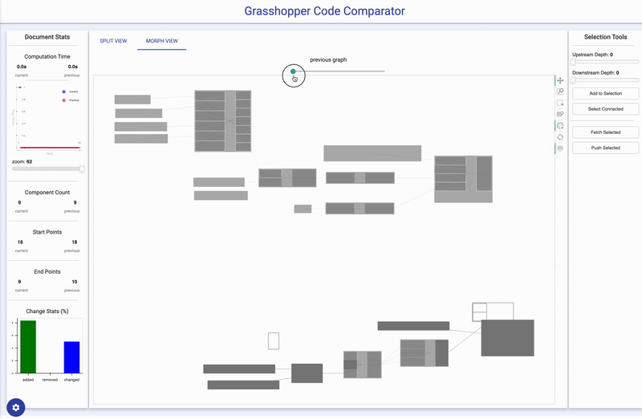
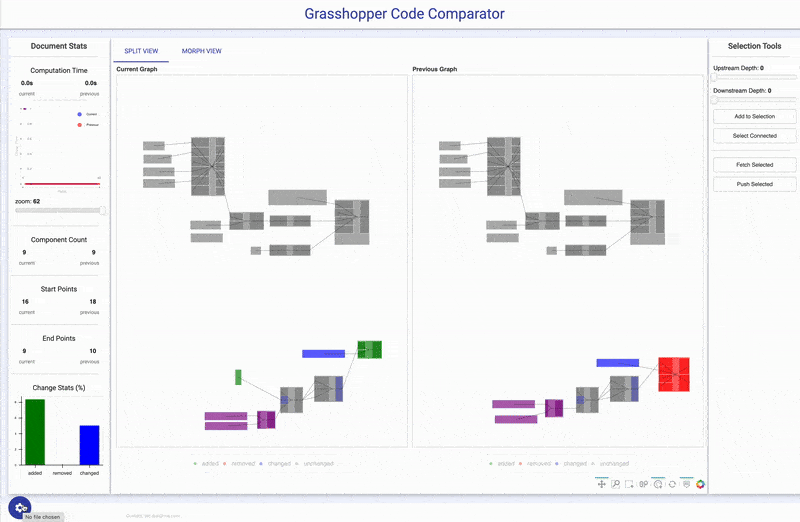
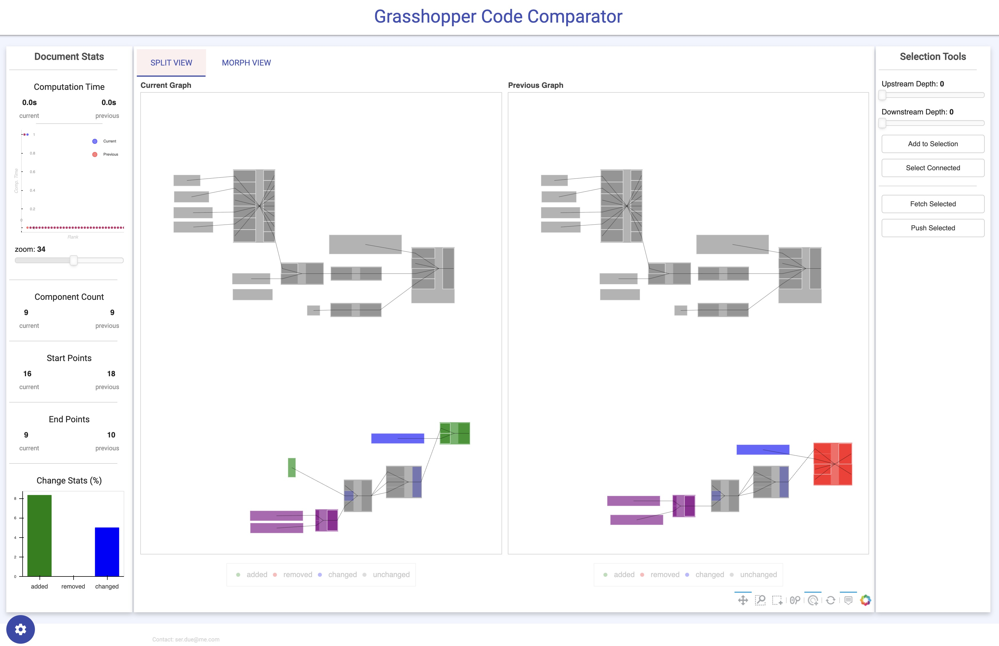
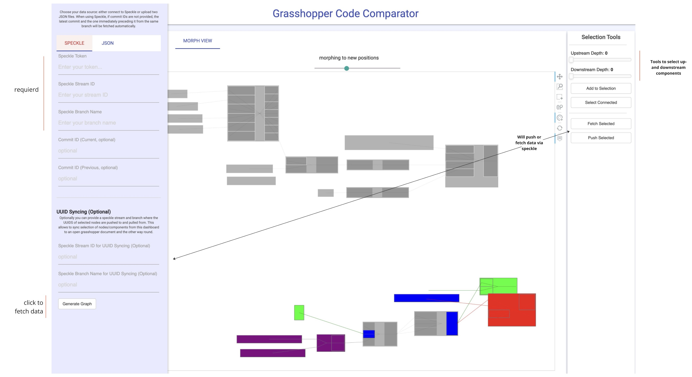
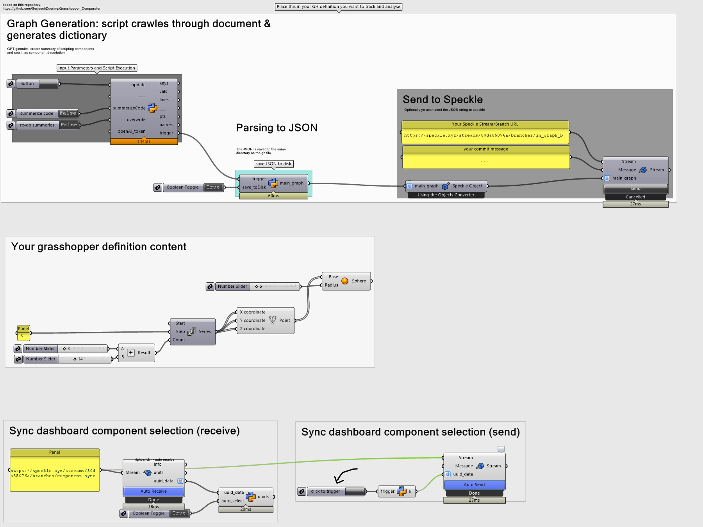

# Grasshopper Code Comparator


**Grasshopper Code Comparator** is a web-based visualization tool designed to compare different versions of Grasshopper definitions. This tool allows users to visually analyze changes, additions, and deletions between two versions of their Grasshopper scripts through interactive graphical representations. Users can either upload JSON files generated from Grasshopper or synchronize data directly using Speckle.
 
> ⚠️  This repro is hosted on render.com. You can test the app [here](https://grasshoppercomparator.onrender.com/myapp)! ⚠️ 

> ⚠️ Tutorial: [youtube](https://youtu.be/ae-oo2KoWWA)



*In the morph view, you can smoothly transition back and forth between two versions of Grasshopper definitions, visually highlighting changes.*

> **Disclaimer:**  
> This project began as a quick afternoon experiment and has evolved into a single-file implementation with over 2000 lines of code. While it shows great potential, please note that it's still a work in progress. I had plans to refine and expand it further, but I haven't yet found the time to do so.

## Features
> ⚠️  Unfortunatly Cluster Contents are not supported yet (I had it implemented once, but the file got currupted and was lost)

- **Side-by-Side Comparison**: Visualize both the current and previous versions of a Grasshopper definition simultaneously, highlighting added, removed, changed, and unchanged components.

- **Morphing View**: Smoothly transition between the old and new versions of the Grasshopper definition to dynamically observe changes.

- **Data Source Configuration**: Flexible setup to manage data sources. Users can upload JSON files or sync data from Speckle, a platform for managing design data.

- **UUID Syncing**: Sync selected nodes or components between the dashboard and open Grasshopper definitions via Speckle, enabling dynamic updates and synchronization.

- **Interactive Graph Visualization**: Provides a detailed visualization of Grasshopper definitions, including node attributes, edges, and changes. Supports interactive selection, filtering, and zooming.



## Getting Started

### Prerequisites

- **Grasshopper**: Ensure Grasshopper is installed and can run Python scripts.
- **Speckle Account**: Required for synchronizing data. Set up an account on Speckle to use its API for data retrieval and updates.

### Installation

1. **Clone the Repository**:

   ```bash
   git clone https://github.com/yourusername/grasshopper-code-comparator.git
   cd grasshopper-code-comparator
   ```

2. **Install Required Packages**:

   ```bash
   pip install -r requirements.txt
   ```
3. **Install Speckle Connector for Grasshopper**: 
requied if you want to use speckle related features

### Usage


1. **Run the Application**:
   - Start the Bokeh server to launch the web application:
   Open a terminal, navigate to the project directory (one level before "myapp") and enter the command:

   ```bash
   bokeh serve myapp
   ```

2. **Uploading or Syncing Data**:
   - In the web interface, you have two options:
     - **Upload JSON Files**: Manually upload JSON files for both the current and previous versions of the Grasshopper definition.
     - **Sync with Speckle**: Enter your Speckle credentials to fetch data directly from your Speckle streams.

3. **Visual Comparison**:
   - **Split View**: Displays the current and previous versions side by side, allowing for direct comparison of changes, additions, and removals.
   - **Morph View**: Provides a morphing transition between the versions, helping to visualize modifications over time.

4. **UUID Syncing (Optional)**:
   - Use the UUID Syncing feature to sync selected nodes or components between Grasshopper and the web interface. This feature helps in maintaining consistency and synchronizing changes dynamically.

5. **Use your own Data**:
- **add the grasshopper snippet to your definition**: Download the "grasshopperSnippet.gh" file, in there you find the snippet that generates a graph/Json representation of the definition. By default its saved to the same filepath as the definition, alternativly you can sync it to speckle. There are also snippets to receive and auto-select nodes/components that were slected on the dashboard/webapp and vice versa.

### Screenshots

#### 1. Side-by-Side Comparison



The split view mode highlights differences between the current and previous Grasshopper definitions, categorizing them as added, removed, changed, or unchanged.

#### 2. Morphing View


Morphing view facilitates a smooth transition between different versions, making it easier to observe the evolution of the Grasshopper definition.

#### 3. Settings Panel


You can open the left side panel by clicking the settings icon on the buttom left.
The settings panel allows you to configure your data source, either by uploading JSON files or synchronizing through Speckle. Optionally, you can provide a speckle stream ID and branch name that is used to sync IDs of selected nodes/compomnents. Additionally, the left panel provides tools to select upstream and downstream components/nodes, trigger syncing selected UUIDs to Speckle, or fetch from Speckle.

#### 4. Grasshopper Snippets


The GrasshopperSnippets.gh file provides components for generating a detailed dictionary of a Grasshopper definition, converting it to JSON, and optionally sending it to Speckle for synchronization with the dashboard. It also allows syncing of selected component UUIDs between Grasshopper and the Grasshopper Code Comparator dashboard.

### Notes

- **Data Handling**: This tool currently does not maintain a persistent storage or database for data management. All data operations are performed locally or via live syncing with Speckle during a session.
- **Speckle Synchronization**: The tool utilizes Speckle for data synchronization, enabling dynamic updates and UUID syncing between Grasshopper definitions and the web interface.

### Contributing

Contributions are welcome! Please submit a pull request or open an issue to discuss any proposed changes.

### License

This project is licensed under the MIT License - see the LICENSE file for details.


